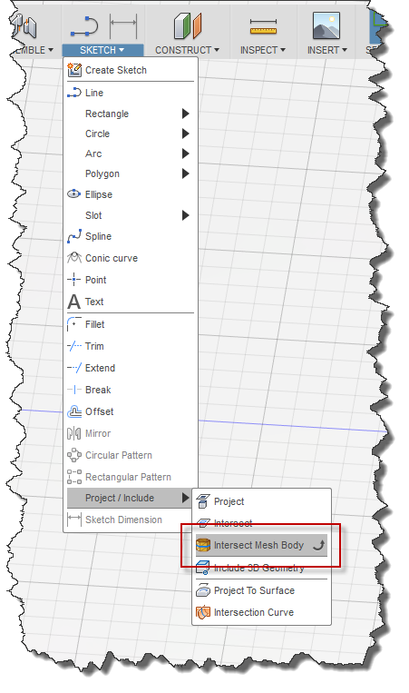
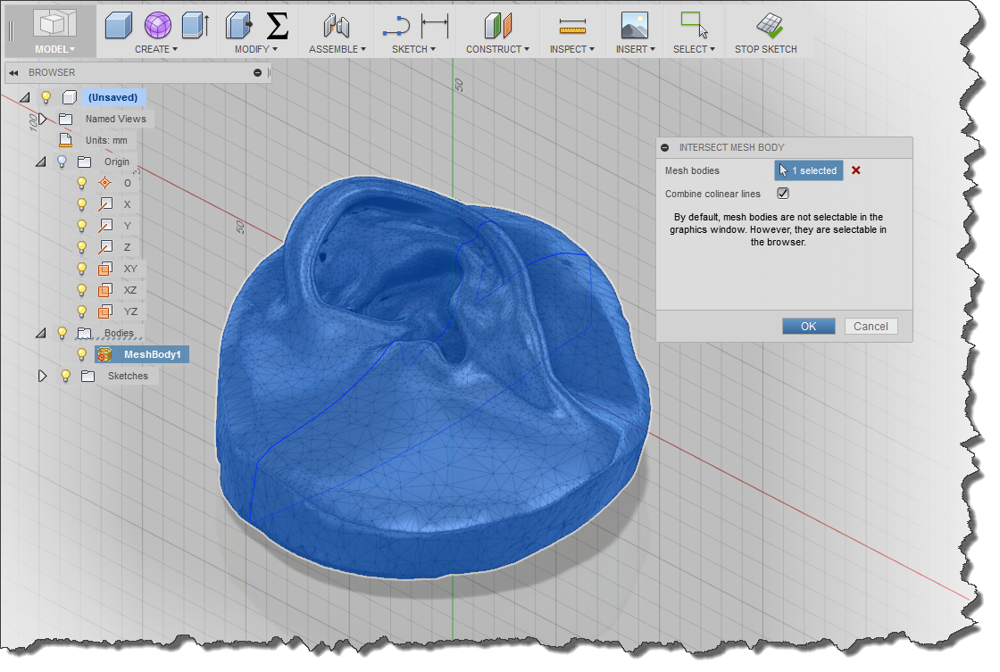
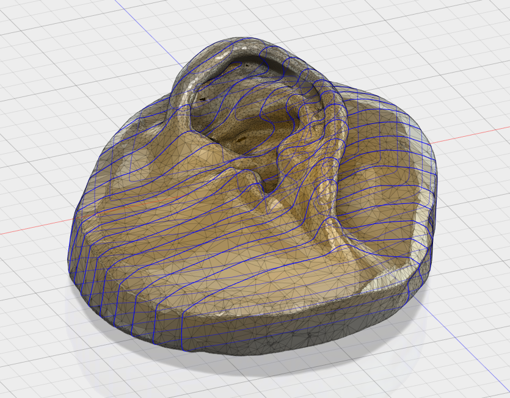

## MeshIntersect
Creates sketch geometry that is the intersection of selected mesh bodies and the x-y plane of the active sketch.

This app allows you to more effectively and precisely use geometry imported from a mesh.  Using this app you can cut sections through a mesh to create standard sketch geometry.  You can then use the sketch geometry to perform precise measurements and to do additional modeling.

### Usage
This app allows you to more effectively and precisely use geometry imported from a mesh.  Using this app you can cut sections through a mesh to create standard sketch geometry.  You can then use the sketch geometry to perform precise measurements and to do additional modeling.

The add-in adds the single "Intersect Mesh Body" command to Fusion in the "Sketch" menu within the "Project/Include" pop-up, as seen in the first screenshot.  To use the command a sketch must be active.  When the command is selected a command dialog is displayed where you are prompted to select one or more mesh bodies.

By default, mesh bodies cannot be selected in the graphics window, but they are always selectable in the browser.  You can change there selectability by using the "Selectable/Unselectable" option in the context menu when right-clicking a mesh body node in the browser.

The initial calculation of the intersection results in a line for every intersection triangle that intersects the sketch plane.  The "Combine colinear lines" option controls whether a connected series of coliniear lines is replaced with a single line.  Depending on the mesh body, this can significantly simplify the result.

The resulting sketch geometry is standard sketch geometry and can be used for measurements or modeling operations.

##### Acessing the command

##### Examples of use

